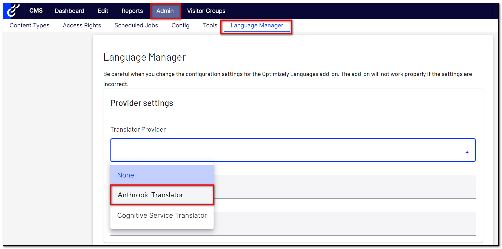
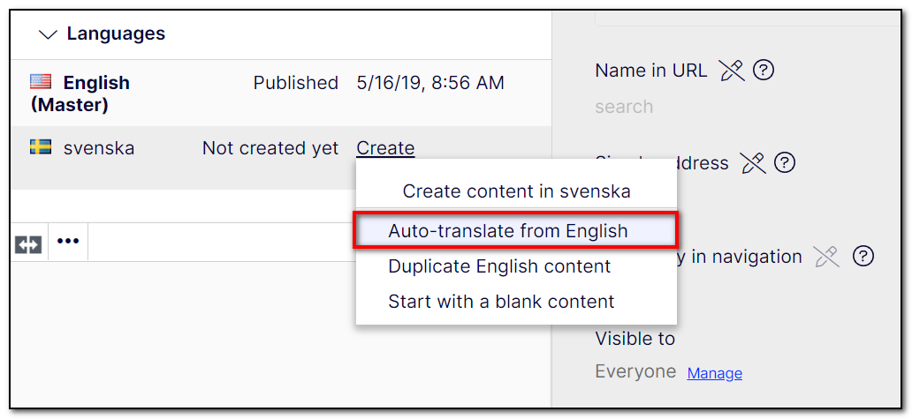

# Gulla.Episerver.Labs.LanguageManager.Anthropic 🤖

This is the readme for the CMS 13 version, the version for CMS 12 is [over here](https://github.com/tomahg/Gulla.Episerver.Labs.LanguageManager.Anthropic/tree/cms12).


This addon for Optimizely CMS enables EPiServer.Labs.LanguageManager to auto-translate content using Anthropic Claude.

## Installation

The command below will install the addon in your Optimizely project.

```
dotnet add package Gulla.Episerver.Labs.LanguageManager.Anthropic
```

## Configuration

For this addon to work, you will have to call the `.AddLanguageManagerAnthropic()` extension method in the Startup.ConfigureServices method.

Below is a code snippet with all possible configuration options. The only required configuration is `AnthropicApiKey`.

```csharp
.AddLanguageManagerAnthropic(x => {
    x.AnthropicApiKey = "**********";
    x.AnthropicModel = AnthropicModels.ClaudeHaiku4_5;
    x.AnthropicMaxTokens = 8192;
    x.AnthropicExtraPrompt = "Make the translation super, super formal.";
})
```

The default values are

-   AnthropicModel = "claude-haiku-4-5"
-   AnthropicMaxTokens = 8192

`AnthropicModel` accepts any valid model identifier as free text. For convenience, the `AnthropicModels` class exposes constants for the currently available models:

-   `AnthropicModels.ClaudeOpus4_8` — most capable
-   `AnthropicModels.ClaudeOpus4_7`
-   `AnthropicModels.ClaudeSonnet4_6`
-   `AnthropicModels.ClaudeSonnet4_5`
-   `AnthropicModels.ClaudeHaiku4_5` — fastest and most cost-effective (default)

You can also configure this addon using `appsettings.json`. A configuration setting specified in `appsettings.json` will override any configuration configured in `Startup.cs`. See the example below:

```JSON
  "Gulla": {
    "LanguageManagerAnthropic": {
      "AnthropicApiKey": "**********",
      "AnthropicModel": "claude-haiku-4-5",
      "AnthropicMaxTokens": 8192,
      "AnthropicExtraPrompt": "Make the translation super, super formal."
    }
  }
```

## Configuring the extra prompt in the CMS

Instead of hard-coding `AnthropicExtraPrompt` in configuration, you can let editors manage the extra prompt on a CMS page. Point the addon at a page and a property using these two settings (both must be set together):

-   `AnthropicExtraPromptPageContentReference` — the content id of the page that holds the extra prompt
-   `AnthropicExtraPromptPagePropertyName` — the name of the (text) property on that page

When both are set, the value of that property is used as the extra prompt **instead of** `AnthropicExtraPrompt`. The page is read on every translation, so editors can change the prompt without a redeploy.

First, add a text property to one of your page types. Use the `Textarea` UI hint so editors get a multi-line editor:

```csharp
using EPiServer.Web; // UIHint

public class TranslationSettingsPage : PageData
{
    [UIHint(UIHint.Textarea)]
    public virtual string TranslationExtraPrompt { get; set; }
}
```

Then point the addon at that page and property:

```csharp
.AddLanguageManagerAnthropic(x => {
    x.AnthropicApiKey = "**********";
    x.AnthropicExtraPromptPageContentReference = 5; // content id of your settings page
    x.AnthropicExtraPromptPagePropertyName = "TranslationExtraPrompt";
})
```

Or via `appsettings.json`:

```JSON
  "Gulla": {
    "LanguageManagerAnthropic": {
      "AnthropicApiKey": "**********",
      "AnthropicExtraPromptPageContentReference": 5,
      "AnthropicExtraPromptPagePropertyName": "TranslationExtraPrompt"
    }
  }
```

Notes:

-   Both settings must be provided together. Setting only one throws a configuration error.
-   An empty property value is allowed and simply means no extra instruction is added.
-   If the page can't be loaded, or the property name doesn't exist on the page, the translation fails with a clear message (rather than silently translating without the intended instruction).

In order for LanguageManager to use this Anthropic Provider, configure it like this.


## Usage

Add the Languages gadget, and auto-translate all you want!


## Contribute

You are welcome to register an issue or create a pull request if you see something that should be improved.
